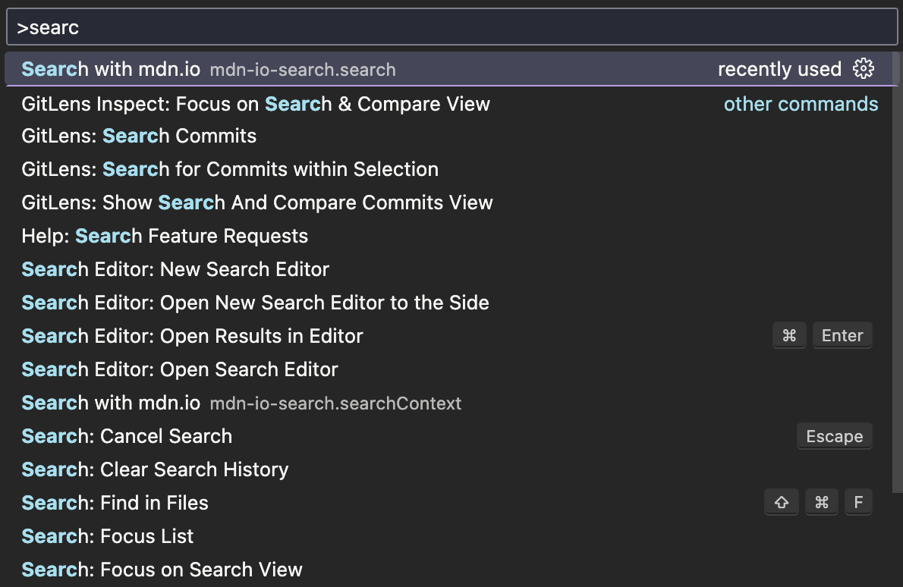
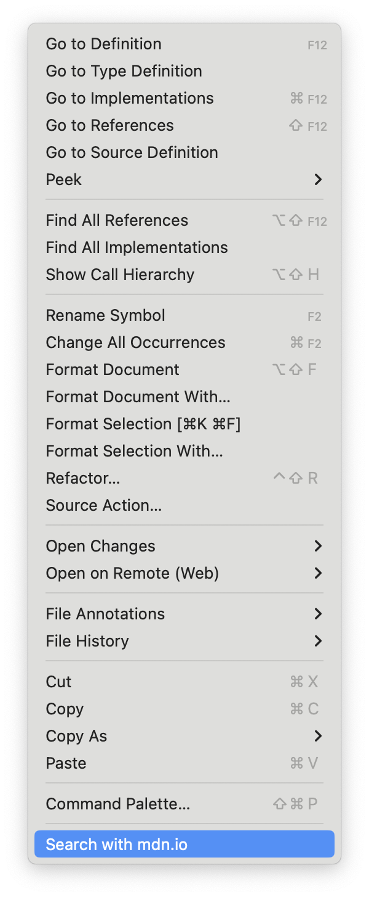

# mdn-io-search

The extension is a way to search anything JavaScript and web-related using [mdn.io](https://github.com/lazd/mdn.io) from the VSCode

## Features

The extension has exactly two features:

1. `mdn.io` search via command palette
   

2. `mdn.io` search via context menu
   

## Release Notes

### 0.1.0

Initial release of mdn-io-search
